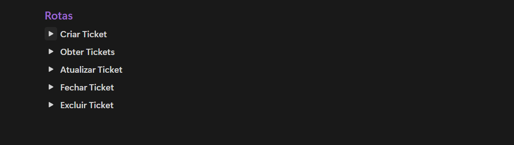

<h1 align="center"> Ticket de Suporte</h1>

Este projeto, desenvolvido em aula, faz parte da trilha Full-Stack, promovido pela Rocketseat para ensino de tecnologias WEB.  

  <a href="#tecnologias">Tecnologias</a>&nbsp;&nbsp;&nbsp;|&nbsp;&nbsp;&nbsp;
  <a href="#projeto">Projeto</a>&nbsp;&nbsp;&nbsp;|&nbsp;&nbsp;&nbsp;
  <a href="#licença">Licença</a>

   

 

  

## Tecnologias

- **Javascript** Linguagem de programação utilizada em toda a aplicação.
- **Node.js** Ambiente de execução do JavaScript no lado do servidor.
- **Http Modules** Criar e gerenciar as rotas da API.

## Projeto

- [EM BREVE..](github)

## Licença

Esse projeto está sob a licença MIT.

---

